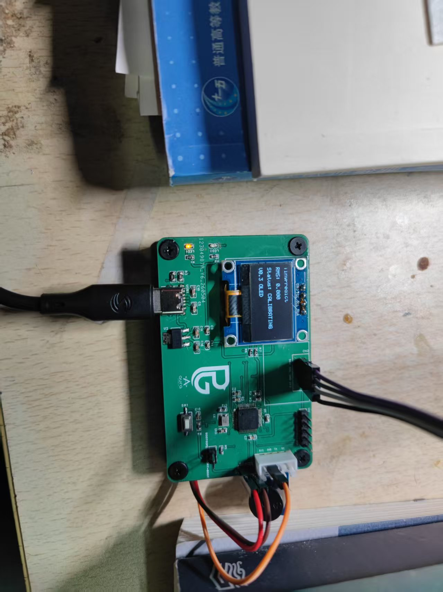
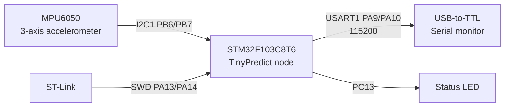

# TinyPredict-STM32

**Version: V0.4B Minimal System PCB**

TinyPredict-STM32 是一个基于 STM32F103C8T6 和 MPU6050 的工业设备振动监测与异常报警节点。项目当前用于采集三轴加速度数据，通过高通滤波和滑动 RMS 算法提取振动强度，并根据阈值输出 NORMAL / WARNING / ALARM 状态。

本项目已完成 STM32CubeIDE 工程搭建、MPU6050 读取、USART1 调试输出、启动校准状态、高通振动检测算法、风扇振动测试、Python CSV 记录、OLED 本地显示实物验证，并已完成 V0.4B STM32F103C8T6 最小系统 PCB 焊接与实物 bring-up 测试。

## 当前完成状态

- STM32CubeIDE 工程创建完成。
- ST-Link SWD 下载调试完成。
- MPU6050 I2C 读取完成。
- USART1 串口输出完成。
- 高通振动检测算法完成。
- 风扇偏心测试完成。
- Python 串口记录 CSV 完成。
- 四组分段测试完成。
- RMS 曲线绘图完成。
- OLED 本地显示已完成实物验证。
- V0.4B STM32F103C8T6 最小系统 PCB 原理图完成。
- PCB Layout 完成。
- Gerber 已生成。
- PCB 已下单。
- 物料已购买。
- V0.4B PCB 已焊接完成。
- V0.4B PCB 电源测试通过。
- V0.4B PCB ST-Link 下载通过。
- PC13 状态 LED 测试通过。
- USART1 串口输出通过。
- OLED 显示通过，并已加入 PG Logo 开机动画。
- MPU6050 接线问题已解决。
- 完整 TinyPredict 主程序测试成功。
- NORMAL / WARNING / ALARM 状态判断测试成功。
- 三脚有源蜂鸣器模块测试成功，ALARM 状态下蜂鸣器报警成功。
- V0.4B PCB final test data collected.
- Final RMS curve generated.
- Buzzer alarm verified in ALARM state.


## 项目展示



V0.4B STM32F103C8T6 minimal system PCB with OLED display, MPU6050 vibration sensor, PG Logo boot animation, USART logging and buzzer alarm.

## 快速开始

1. 硬件接线：按本文档的引脚连接表连接 MPU6050、USB 转 TTL 和 ST-Link，并确认所有模块共地。
2. 编译工程：使用 STM32CubeIDE 打开 `TinyPredict-STM32.ioc` 或工程目录，选择 Debug 配置并编译。
3. ST-Link 下载：通过 ST-Link 使用 SWD 将固件下载到 STM32F103C8T6。
4. 打开串口助手：选择 USB 转 TTL 对应串口，设置为 115200 baud，8N1。
5. 查看 rms 和 status：Reset 后等待 CALIBRATING 结束，观察串口中的 `rms` 和 `status` 字段。

## 项目特点

- 主控芯片：STM32F103C8T6。
- 传感器：MPU6050 三轴加速度计，通过 I2C1 读取。
- 调试下载：ST-Link SWD。
- 串口输出：USART1，115200 baud。
- 算法：低通估计重力分量，高通提取动态振动分量，32 点滑动 RMS 计算振动强度。
- 状态：启动阶段 CALIBRATING，运行阶段 NORMAL / WARNING / ALARM。
- 已完成风扇振动测试，具备基础异常区分能力。

## 系统框图



## 硬件清单

| 名称 | 数量 | 说明 |
| --- | ---: | --- |
| STM32F103C8T6 最小系统板 | 1 | 主控节点 |
| MPU6050 模块 | 1 | 三轴加速度传感器 |
| ST-Link | 1 | SWD 下载和调试 |
| USB 转 TTL 模块 | 1 | 串口日志输出 |
| 杜邦线 | 若干 | 连接传感器和调试接口 |
| 3.3V 电源 | 1 | 可由开发板或 ST-Link 供电，需共地 |

## 引脚连接表

### MPU6050

| MPU6050 | STM32F103C8T6 | 说明 |
| --- | --- | --- |
| VCC | 3.3V | 传感器供电 |
| GND | GND | 共地 |
| SCL | PB6 / I2C1_SCL | I2C 时钟 |
| SDA | PB7 / I2C1_SDA | I2C 数据 |


### OLED

0.96 寸 SSD1306 OLED 与 MPU6050 共用 I2C1：

| OLED | STM32F103C8T6 | 说明 |
| --- | --- | --- |
| VCC | 3.3V | OLED 供电 |
| GND | GND | 共地 |
| SCL | PB6 / I2C1_SCL | 与 MPU6050 共用 I2C 时钟 |
| SDA | PB7 / I2C1_SDA | 与 MPU6050 共用 I2C 数据 |
### USART1

| STM32F103C8T6 | USB 转 TTL | 说明 |
| --- | --- | --- |
| PA9 / USART1_TX | RX | STM32 发送日志 |
| PA10 / USART1_RX | TX | 预留接收 |
| GND | GND | 共地 |

### ST-Link

| ST-Link | STM32F103C8T6 | 说明 |
| --- | --- | --- |
| SWDIO | PA13 | SWD 数据 |
| SWCLK | PA14 | SWD 时钟 |
| GND | GND | 共地 |
| 3.3V | 3.3V | 目标板供电或电平参考 |

## 软件功能

- 初始化 HAL、GPIO、I2C1、USART1。
- 通过 I2C1 初始化 MPU6050，读取 WHO_AM_I 并退出睡眠模式。
- 周期读取 ax、ay、az 三轴加速度，单位为 g。
- 启动后进入 CALIBRATING 阶段，学习慢变化重力分量。
- READY 阶段使用低通估计重力分量，并用高通分量计算振动 RMS。
- 根据 RMS 判断 NORMAL / WARNING / ALARM。
- 通过 USART1 每 500 ms 输出 CSV 调试数据。
- ALARM 状态下控制 PC13 状态 LED。

## Serial CSV Output

串口参数：115200 baud，8N1。固件通过 `debug_uart` 模块管理 USART1 调试输出，启动后会输出 OLED 初始化结果和 CSV 表头：

```text
OLED init ok
time_ms,ax,ay,az,rms,status
```

正常运行阶段每 500 ms 输出一行 CSV 样本：

```text
1234,0.012,-0.034,1.002,0.056,NORMAL
```

字段说明：

| 字段 | 说明 |
| --- | --- |
| time_ms | `HAL_GetTick()` 系统时间，单位 ms |
| ax / ay / az | MPU6050 三轴原始加速度，单位 g |
| rms | 最近 32 个振动幅值的滑动 RMS |
| status | 当前状态：CALIBRATING / NORMAL / WARNING / ALARM |

如果 MPU6050 初始化或读取失败，串口会输出 `MPU6050 init failed`，Python 记录工具会把这类非数据行作为 info 打印，不写入 CSV 数据区。

Python 串口日志工具优先解析上述固件 CSV 输出，同时尽量兼容旧版 `t=... ax=... rms=... status=...` 文本格式。常用命令如下：

```powershell
python tools/serial_logger.py --list-ports
python tools/serial_logger.py --port COM5 --baud 115200
python tools/serial_logger.py --port COM5 --baud 115200 --out docs/data/test.csv
```

如果未指定 `--out`，默认保存到 `docs/data/log_YYYYMMDD_HHMMSS.csv`，并自动创建输出目录。CSV 字段固定为：

```text
time_ms,ax,ay,az,rms,status
```


## 测试结果

当前基于风扇振动测试得到的 RMS 数据如下：

| 测试状态 | RMS | 判断状态 |
| --- | ---: | --- |
| 静止/稳定 | 0.012 | NORMAL |
| 正常运行 | 0.017 | NORMAL |
| 轻微异常 | 0.085 | WARNING |
| 明显异常 | 0.400 | ALARM |

当前阈值：

| 状态 | 条件 |
| --- | --- |
| NORMAL | rms < 0.05 |
| WARNING | 0.05 <= rms < 0.15 |
| ALARM | rms >= 0.15 |
## V0.4B PCB Bring-up Result

V0.4B STM32F103C8T6 最小系统 PCB 已完成焊接和分阶段 bring-up。当前已验证：

- 电源测试通过。
- ST-Link 下载通过。
- PC13 状态 LED 测试通过。
- USART1 串口输出通过。
- OLED 显示通过。
- MPU6050 接线问题已解决。
- 完整 TinyPredict 主程序测试成功。
- NORMAL / WARNING / ALARM 状态判断测试成功。
- PG Logo OLED 开机动画完成。

实物测试经验：MPU6050 需要固定在被测物体上，线束也要固定，避免 I2C 接线晃动导致 OLED 显示异常或传感器读数不稳定。
蜂鸣器报警输出已在 V0.4B PCB 实物上完成验证。当前使用三脚有源蜂鸣器模块，接线为：

| 蜂鸣器模块 | STM32 / PCB | 说明 |
| --- | --- | --- |
| VCC | 3V3 | 蜂鸣器供电 |
| GND | GND | 共地 |
| I/O | PB12 | 低电平触发控制脚 |

触发逻辑：`PB12 = 0` 时蜂鸣器响，`PB12 = 1` 时蜂鸣器关闭。NORMAL 和 CALIBRATING 状态下蜂鸣器关闭，WARNING 状态短鸣提示，ALARM 状态下蜂鸣器报警已测试成功。

## System Status

运行阶段的 NORMAL / WARNING / ALARM 状态由 `system_status` 模块统一管理，当前基于 RMS 阈值、迟滞和连续计数防抖判断。OLED、串口 CSV 和 PC13 LED 报警共享同一状态来源，避免各模块重复维护阈值逻辑。

核心进入阈值保持当前项目含义不变：

| 状态切换 | 条件 | 连续次数 |
| --- | --- | ---: |
| NORMAL -> WARNING | rms >= 0.05 | 3 |
| WARNING -> ALARM | rms >= 0.15 | 3 |
| NORMAL -> ALARM | rms >= 0.15 | 3 |

恢复阈值使用迟滞，避免 RMS 在边界附近来回跳变：

| 状态切换 | 条件 | 连续次数 |
| --- | --- | ---: |
| WARNING -> NORMAL | rms < 0.04 | 5 |
| ALARM -> WARNING / NORMAL | rms < 0.12 后根据 RMS 回落 | 5 |

启动校准阶段仍由振动算法状态输出 `CALIBRATING`，不触发 LED 报警。后续可以在 `system_status` 模块中继续升级报警确认、静音模式和远程 status 查询逻辑。

## 工具

V0.2 新增 Python 串口数据记录和 RMS 曲线绘图工具，当前记录工具已兼容 V0.4B 固件 CSV 输出：

```powershell
python tools/serial_logger.py --list-ports
python tools/serial_logger.py --port COM5 --baud 115200
python tools/serial_logger.py --port COM5 --baud 115200 --out docs/data/test.csv
```

`serial_logger.py` 用于记录 STM32 USART1 输出并保存为 CSV 文件。默认输出路径为 `docs/data/log_YYYYMMDD_HHMMSS.csv`，字段为 `time_ms,ax,ay,az,rms,status`。四组分段测试完成后可使用绘图工具生成 RMS 曲线图。详细说明见 [tools/README.md](tools/README.md)。


## Analyze CSV Logs

V0.4B 工具链新增 `tools/analyze_log.py`，用于读取 `serial_logger.py` 生成的 CSV，并自动生成 RMS 曲线、三轴加速度曲线、状态统计图和 Markdown 实验报告。

安装依赖：

```powershell
python -m pip install -r tools/requirements.txt
```

分析指定 CSV：

```powershell
python tools/analyze_log.py --file docs/data/test.csv
```

分析最新日志：

```powershell
python tools/analyze_log.py --latest
```

输入 CSV 必须包含字段：

```text
time_ms,ax,ay,az,rms,status
```

输出文件包括：

- `docs/images/analysis/xxx_rms.png`：RMS 曲线图。
- `docs/images/analysis/xxx_accel.png`：ax / ay / az 加速度曲线图。
- `docs/images/analysis/xxx_status_count.png`：状态统计图。
- `docs/data/xxx_report.md`：自动生成的 Markdown 实验报告。

## OLED 本地显示

V0.3 已完成 0.96 寸 SSD1306 OLED 本地显示功能，并通过实物验证。V0.4B 已在 PCB 实物上验证 OLED 显示，并加入 PG Logo 开机动画。OLED 与 MPU6050 共用 I2C1。主界面显示内容包括：

```text
TinyPredict
RMS: 0.000
Status: NORMAL
V0.3 OLED
```

实物验证中 OLED 可以正常点亮，并实时显示 RMS 和 NORMAL / WARNING / ALARM / CALIBRATING 状态。

OLED 开机后会先显示 PG Logo 动画，再显示 `TinyPredict / V0.4B Ready`，随后进入 RMS / Status 主界面。OLED 每 300 ms 刷新一次。若 OLED 未连接或初始化失败，系统仍继续运行 MPU6050 采集和 USART1 串口输出；串口会输出 `OLED init failed`。初始化成功时串口输出 OLED init ok。

## RMS 曲线

V0.2 已完成 `idle`、`normal`、`slight_unbalance`、`severe_unbalance` 四组分段测试，并生成 RMS 曲线图。图中包含 WARNING 阈值 0.05 和 ALARM 阈值 0.15。测试 CSV 原始数据已整理到 `docs/data/`。


V0.4B PCB 实物最终测试已完成 `idle`、`normal_run`、`medium_unbalance`、`severe_unbalance` 四组数据采集。JSON 原始数据已转换为 CSV 并整理到 `docs/data/v04b_final/`，最终 RMS 曲线如下：


## 项目目录结构

```text
TinyPredict-STM32/
├── Core/
│   ├── Inc/
│   │   ├── alarm_task.h
│   │   ├── app_main.h
│   │   ├── debug_uart.h
│   │   ├── main.h
│   │   ├── mpu6050.h
│   │   ├── sensor_task.h
│   │   ├── system_status.h
│   │   ├── vibration_algo.h
│   │   ├── ssd1306.h
│   │   └── oled_ui.h
│   └── Src/
│       ├── alarm_task.c
│       ├── app_main.c
│       ├── debug_uart.c
│       ├── main.c
│       ├── mpu6050.c
│       ├── sensor_task.c
│       ├── system_status.c
│       ├── vibration_algo.c
│       ├── ssd1306.c
│       └── oled_ui.c
├── Drivers/
├── docs/
│   ├── algorithm.md
│   ├── development_log.md
│   ├── data/
│   │   └── tinypredict_*.csv
│   ├── images/
│   │   ├── prototype_v03.jpg
│   │   └── rms_test_curve.png
│   ├── hardware_wiring.md
│   ├── pcb_bom_v04a.md
│   ├── pcb_bom_v04b.md
│   ├── pcb_design_plan.md
│   ├── pcb_layout_steps_v04a.md
│   ├── pcb_layout_steps_v04b.md
│   ├── pcb_schematic_checklist.md
│   ├── pcb_schematic_connection_table.md
│   └── test_report.md
├── tools/
│   ├── README.md
│   └── serial_logger.py
├── STM32F103C8TX_FLASH.ld
├── TinyPredict-STM32.ioc
└── README.md
```

## 后续计划

- 外壳与传感器固定结构。
- 更多电机振动数据采集。

V0.4B PCB 文档见 [docs/pcb_design_plan.md](docs/pcb_design_plan.md)、[docs/pcb_bom_v04b.md](docs/pcb_bom_v04b.md)、[docs/pcb_schematic_checklist.md](docs/pcb_schematic_checklist.md)、[docs/pcb_schematic_connection_table.md](docs/pcb_schematic_connection_table.md) 和 [docs/pcb_layout_steps_v04b.md](docs/pcb_layout_steps_v04b.md)。


