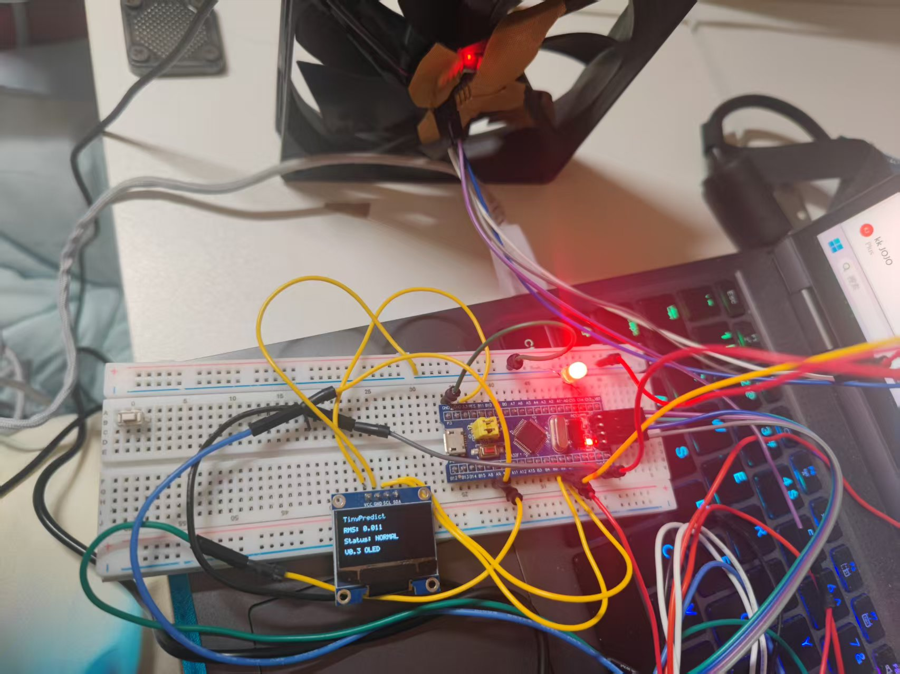
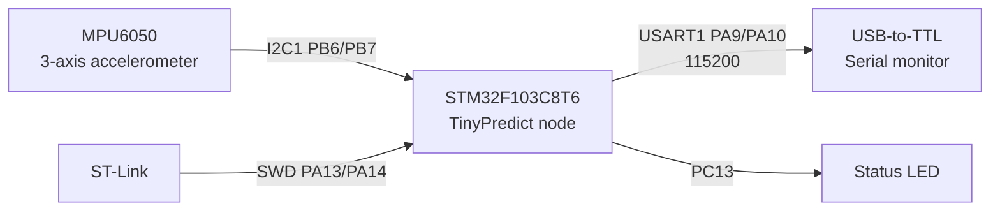
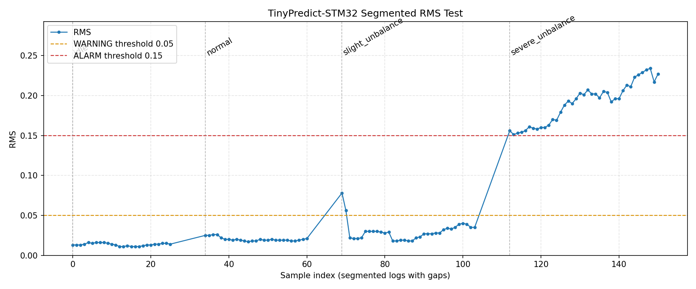

# TinyPredict-STM32

**Version: V0.3 Prototype**

TinyPredict-STM32 是一个基于 STM32F103C8T6 和 MPU6050 的工业设备振动监测与异常报警节点。项目当前用于采集三轴加速度数据，通过高通滤波和滑动 RMS 算法提取振动强度，并根据阈值输出 NORMAL / WARNING / ALARM 状态。

本项目已完成 STM32CubeIDE 工程搭建、MPU6050 读取、USART1 调试输出、启动校准状态、高通振动检测算法、风扇振动测试、Python CSV 记录与 OLED 本地显示实物验证，适合作为低成本工业振动监测原型节点继续扩展。

## 当前完成状态

- STM32CubeIDE 工程创建完成。
- ST-Link SWD 下载调试完成。
- MPU6050 I2C 读取完成。
- USART1 串口输出完成。
- 高通振动检测算法完成。
- 风扇偏心测试完成。
- Python 串口记录 CSV 完成。
- 四组分段测试完成。
- RMS 曲线绘图完成。
- OLED 本地显示已完成实物验证。
- PCB、图形化上位机暂未完成。

## 项目展示



V0.3 prototype with STM32F103C8T6, MPU6050, OLED display and fan vibration test platform.

## 快速开始

1. 硬件接线：按本文档的引脚连接表连接 MPU6050、USB 转 TTL 和 ST-Link，并确认所有模块共地。
2. 编译工程：使用 STM32CubeIDE 打开 `TinyPredict-STM32.ioc` 或工程目录，选择 Debug 配置并编译。
3. ST-Link 下载：通过 ST-Link 使用 SWD 将固件下载到 STM32F103C8T6。
4. 打开串口助手：选择 USB 转 TTL 对应串口，设置为 115200 baud，8N1。
5. 查看 rms 和 status：Reset 后等待 CALIBRATING 结束，观察串口中的 `rms` 和 `status` 字段。

## 项目特点

- 主控芯片：STM32F103C8T6。
- 传感器：MPU6050 三轴加速度计，通过 I2C1 读取。
- 调试下载：ST-Link SWD。
- 串口输出：USART1，115200 baud。
- 算法：低通估计重力分量，高通提取动态振动分量，32 点滑动 RMS 计算振动强度。
- 状态：启动阶段 CALIBRATING，运行阶段 NORMAL / WARNING / ALARM。
- 已完成风扇振动测试，具备基础异常区分能力。

## 系统框图



## 硬件清单

| 名称 | 数量 | 说明 |
| --- | ---: | --- |
| STM32F103C8T6 最小系统板 | 1 | 主控节点 |
| MPU6050 模块 | 1 | 三轴加速度传感器 |
| ST-Link | 1 | SWD 下载和调试 |
| USB 转 TTL 模块 | 1 | 串口日志输出 |
| 杜邦线 | 若干 | 连接传感器和调试接口 |
| 3.3V 电源 | 1 | 可由开发板或 ST-Link 供电，需共地 |

## 引脚连接表

### MPU6050

| MPU6050 | STM32F103C8T6 | 说明 |
| --- | --- | --- |
| VCC | 3.3V | 传感器供电 |
| GND | GND | 共地 |
| SCL | PB6 / I2C1_SCL | I2C 时钟 |
| SDA | PB7 / I2C1_SDA | I2C 数据 |


### OLED

0.96 寸 SSD1306 OLED 与 MPU6050 共用 I2C1：

| OLED | STM32F103C8T6 | 说明 |
| --- | --- | --- |
| VCC | 3.3V | OLED 供电 |
| GND | GND | 共地 |
| SCL | PB6 / I2C1_SCL | 与 MPU6050 共用 I2C 时钟 |
| SDA | PB7 / I2C1_SDA | 与 MPU6050 共用 I2C 数据 |
### USART1

| STM32F103C8T6 | USB 转 TTL | 说明 |
| --- | --- | --- |
| PA9 / USART1_TX | RX | STM32 发送日志 |
| PA10 / USART1_RX | TX | 预留接收 |
| GND | GND | 共地 |

### ST-Link

| ST-Link | STM32F103C8T6 | 说明 |
| --- | --- | --- |
| SWDIO | PA13 | SWD 数据 |
| SWCLK | PA14 | SWD 时钟 |
| GND | GND | 共地 |
| 3.3V | 3.3V | 目标板供电或电平参考 |

## 软件功能

- 初始化 HAL、GPIO、I2C1、USART1。
- 通过 I2C1 初始化 MPU6050，读取 WHO_AM_I 并退出睡眠模式。
- 周期读取 ax、ay、az 三轴加速度，单位为 g。
- 启动后进入 CALIBRATING 阶段，学习慢变化重力分量。
- READY 阶段使用低通估计重力分量，并用高通分量计算振动 RMS。
- 根据 RMS 判断 NORMAL / WARNING / ALARM。
- 通过 USART1 每 500 ms 输出状态信息。
- ALARM 状态下控制 PC13 状态 LED。

## 串口输出格式

串口参数：115200 baud，8N1。

校准阶段：

```text
Calibrating... ax=0.098, ay=-0.860, az=0.504, rms=0.000, status=CALIBRATING
```

正常运行阶段：

```text
ax=0.098, ay=-0.860, az=0.504, vx=-0.001, vy=0.012, vz=-0.004, rms=0.018, status=NORMAL
```

字段说明：

| 字段 | 说明 |
| --- | --- |
| ax / ay / az | MPU6050 三轴原始加速度，单位 g |
| vx / vy / vz | 高通后的动态振动分量，单位 g |
| rms | 最近 32 个振动幅值的滑动 RMS |
| status | 当前状态：CALIBRATING / NORMAL / WARNING / ALARM |

## 测试结果

当前基于风扇振动测试得到的 RMS 数据如下：

| 测试状态 | RMS | 判断状态 |
| --- | ---: | --- |
| 静止/稳定 | 0.012 | NORMAL |
| 正常运行 | 0.017 | NORMAL |
| 轻微异常 | 0.085 | WARNING |
| 明显异常 | 0.400 | ALARM |

当前阈值：

| 状态 | 条件 |
| --- | --- |
| NORMAL | rms < 0.05 |
| WARNING | 0.05 <= rms < 0.15 |
| ALARM | rms >= 0.15 |

## 工具

V0.2 新增 Python 串口数据记录和 RMS 曲线绘图工具：

```powershell
py tools/serial_logger.py --port COM5 --baud 115200 --label normal
```

该工具会解析 STM32 串口输出中的 `ax`、`ay`、`az`、`vx`、`vy`、`vz`、`rms`、`status`，并保存为 CSV 文件；四组分段测试完成后可生成 RMS 曲线图。详细说明见 [tools/README.md](tools/README.md)。


## OLED 本地显示

V0.3 已完成 0.96 寸 SSD1306 OLED 本地显示功能，并通过实物验证。OLED 与 MPU6050 共用 I2C1。显示内容包括：

```text
TinyPredict
RMS: 0.000
Status: NORMAL
V0.3 OLED
```

实物验证中 OLED 可以正常点亮，并实时显示 RMS 和 NORMAL / WARNING / ALARM / CALIBRATING 状态。

OLED 每 300 ms 刷新一次。若 OLED 未连接或初始化失败，系统仍继续运行 MPU6050 采集和 USART1 串口输出；串口会输出 `OLED init failed`。初始化成功时串口输出 OLED init ok。

## RMS 曲线

V0.2 已完成 `idle`、`normal`、`slight_unbalance`、`severe_unbalance` 四组分段测试，并生成 RMS 曲线图。图中包含 WARNING 阈值 0.05 和 ALARM 阈值 0.15。



## 项目目录结构

```text
TinyPredict-STM32/
├── Core/
│   ├── Inc/
│   │   ├── alarm_task.h
│   │   ├── app_main.h
│   │   ├── main.h
│   │   ├── mpu6050.h
│   │   ├── sensor_task.h
│   │   ├── vibration_algo.h
│   │   ├── ssd1306.h
│   │   └── oled_ui.h
│   └── Src/
│       ├── alarm_task.c
│       ├── app_main.c
│       ├── main.c
│       ├── mpu6050.c
│       ├── sensor_task.c
│       ├── vibration_algo.c
│       ├── ssd1306.c
│       └── oled_ui.c
├── Drivers/
├── docs/
│   ├── algorithm.md
│   ├── development_log.md
│   ├── hardware_wiring.md
│   ├── pcb_bom_v04a.md
│   ├── pcb_design_plan.md
│   ├── pcb_layout_steps_v04a.md
│   ├── pcb_schematic_connection_table.md
│   └── test_report.md
├── tools/
│   ├── README.md
│   └── serial_logger.py
├── STM32F103C8TX_FLASH.ld
├── TinyPredict-STM32.ioc
└── README.md
```

## 后续计划

- V0.4 PCB carrier board：先做 Blue Pill / STM32F103C8T6 开发板底板版本，替代面包板和杜邦线。
- V0.4A 开发板接口版优先，完整 STM32F103C8T6 最小系统版放到后续版本。
- 外壳与固定结构。
- 更多电机测试数据。

V0.4 PCB 规划见 [docs/pcb_design_plan.md](docs/pcb_design_plan.md)，V0.4A 物料、原理图连接和画板步骤见 [docs/pcb_bom_v04a.md](docs/pcb_bom_v04a.md)、[docs/pcb_schematic_connection_table.md](docs/pcb_schematic_connection_table.md)、[docs/pcb_layout_steps_v04a.md](docs/pcb_layout_steps_v04a.md)。


