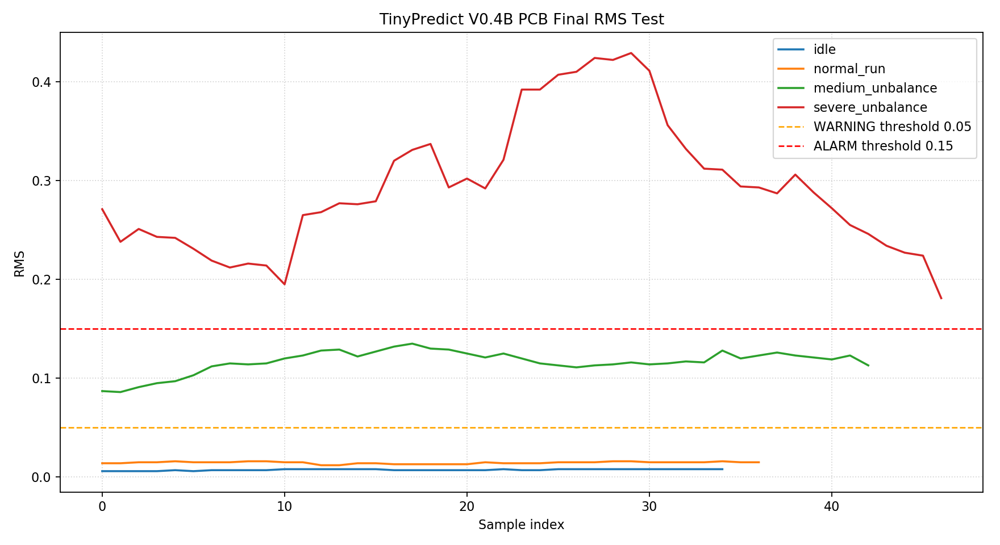

# TinyPredict-STM32 测试报告

## 测试目的

本次测试用于验证 TinyPredict-STM32 在不同振动状态下的 RMS 输出变化，并评估当前阈值是否能够区分稳定、正常运行、轻微异常和明显异常状态。

测试重点包括：

- MPU6050 三轴加速度采集是否稳定。
- 高通振动算法是否能抑制慢速姿态变化。
- RMS 是否能反映振动强度变化。
- NORMAL / WARNING / ALARM 阈值是否具备初步可用性。

## 测试设备

| 设备 | 说明 |
| --- | --- |
| STM32F103C8T6 最小系统板 | 主控节点 |
| MPU6050 模块 | 三轴加速度采集 |
| ST-Link | 下载和调试 |
| USB 转 TTL 模块 | 串口日志输出 |
| 风扇测试对象 | 用于产生稳定和异常振动 |
| 串口监视工具 | 115200 baud，观察 ax、ay、az、vx、vy、vz、rms、status |

## 测试平台

V0.3 prototype with STM32F103C8T6, MPU6050, OLED display and fan vibration test platform.

MPU6050 固定在风扇外壳或支架上，用于采集风扇运行过程中的振动。OLED 可在测试现场实时显示 RMS 和状态，便于不依赖串口工具进行快速观察。

## 传感器安装方式

MPU6050 模块固定在被测风扇外壳、支架或其结构件上，用于采集设备运行时的三轴加速度变化。测试时需要尽量保证模块固定可靠，避免杜邦线拉扯、模块松动或接触不良导致额外振动。

建议安装原则：

- 模块与被测结构刚性连接。
- 传感器固定方向保持一致，便于不同测试之间对比。
- 线缆留有余量，避免线缆晃动直接影响模块。
- 开机校准阶段保持设备和传感器静止。

## 测试方法

测试过程中 OLED 可实时显示 RMS 和状态，用于现场观察。

本次测试采用分段采集方法。由于制造轻微偏心和明显偏心需要停机贴胶带，无法在电机正常转动后立即连续切换到偏心状态。该方法不会影响 RMS 对比结论，因为每个工况都单独采集稳定后的有效 RMS 数据，再进行横向比较。

分段采集包括：

| 分段标签 | 测试状态 |
| --- | --- |
| idle | 静止/稳定状态 |
| normal | 正常转动状态 |
| slight_unbalance | 轻微偏心状态 |
| severe_unbalance | 明显偏心状态 |

1. 使用 ST-Link 将固件下载到 STM32F103C8T6。
2. 打开串口监视工具，配置为 115200 baud，8N1。
3. Reset 后保持模块静止，等待 CALIBRATING 阶段结束。
4. 记录静止或稳定状态下 RMS。
5. 让风扇进入正常运行状态，记录 RMS。
6. 制造轻微异常状态，记录 RMS 和 status。
7. 制造明显异常状态，记录 RMS 和 status。
8. 对比不同状态下 RMS 与阈值之间的关系。

## 本次使用的 CSV 文件

本次 V0.2 测试报告只使用最终有效 CSV 文件。实际采用文件如下：

CSV 原始数据文件统一存放在 docs/data/ 目录。

| 分段标签 | CSV 文件 |
| --- | --- |
| idle | `tinypredict_idle_20260502_203200.csv` |
| normal | `tinypredict_normal_20260502_203243.csv` |
| slight_unbalance | `tinypredict_slight_unbalance_20260502_204730.csv` |
| severe_unbalance | `tinypredict_severe_unbalance_20260502_205423.csv` |

## RMS 数据表格

| 测试状态 | 实测 RMS | 期望状态 | 说明 |
| --- | ---: | --- | --- |
| 静止/稳定状态 | 0.012 | NORMAL | 背景噪声较低 |
| 正常运行状态 | 0.017 | NORMAL | 正常振动低于报警阈值 |
| 轻微异常状态 | 0.085 | WARNING | 可检测到异常增大 |
| 明显异常状态 | 0.400 | ALARM | 明显超过报警阈值 |

当前阈值设置：

| 状态 | 条件 |
| --- | --- |
| NORMAL | rms < 0.05 |
| WARNING | 0.05 <= rms < 0.15 |
| ALARM | rms >= 0.15 |

## V0.1 测试数据汇总

| 测试状态 | RMS | 判断状态 |
| --- | ---: | --- |
| 静止/稳定 | 0.012 | NORMAL |
| 正常运行 | 0.017 | NORMAL |
| 轻微异常 | 0.085 | WARNING |
| 明显异常 | 0.400 | ALARM |

## 无效数据说明

本次测试中，第三组 `slight_unbalance` 进行了多次采集，其中部分数据因测试条件或连接状态不满足要求，已作废处理，不纳入 RMS 结果分析。

无效数据记录如下：

| 采集次数 | 处理结果 | 作废原因 |
| --- | --- | --- |
| slight_unbalance 第一次采集 | 作废 | 胶带贴少，偏心制造条件不符合预期 |
| slight_unbalance 第二次采集 | 作废 | MPU6050 连接不稳定 |
| slight_unbalance 第三次采集 | 作废 | MPU6050 仍未连接稳定 |

最终报告只采用连接稳定、偏心条件正确的 `slight_unbalance` 有效采集数据。四组工况均只使用最终有效 CSV 进行 RMS 曲线绘制和结果分析。上述作废处理属于测试过程中的数据质量控制，不影响最终 RMS 对比结论。
## RMS 曲线

四组最终有效 CSV 已按 `idle`、`normal`、`slight_unbalance`、`severe_unbalance` 的顺序拼接绘图。图中包含 WARNING 阈值 0.05 和 ALARM 阈值 0.15。

## V0.4B PCB 实物 Bring-up 测试

V0.4B STM32F103C8T6 最小系统 PCB 已完成焊接，并按照分阶段 bring-up 流程完成实物验证。测试结果如下：

| 测试项目 | 结果 | 说明 |
| --- | --- | --- |
| PCB 焊接 | 通过 | V0.4B PCB 已焊接完成 |
| 电源测试 | 通过 | 上电后电源轨测试正常 |
| ST-Link 下载 | 通过 | SWD 可连接并可下载固件 |
| PC13 状态 LED | 通过 | LED 测试模式下可正常翻转 |
| USART1 串口输出 | 通过 | 115200 baud 输出正常 |
| OLED 显示 | 通过 | OLED 可显示 TinyPredict、RMS、Status，并支持 PG Logo OLED 开机动画 |
| MPU6050 接线 | 通过 | 接线问题已解决，可正常读取传感器数据 |
| 完整 TinyPredict 主程序 | 通过 | 完整采集、算法、显示、串口输出流程测试成功 |
| 状态判断 | 通过 | NORMAL / WARNING / ALARM 状态判断测试成功 |
| 三脚有源蜂鸣器模块 | 通过 | VCC 接 3V3，GND 接 GND，I/O 接 PB12，低电平触发 |
| ALARM 蜂鸣器报警 | 通过 | ALARM 状态下蜂鸣器报警成功 |

蜂鸣器模块为低电平触发：`PB12 = 0` 时蜂鸣器响，`PB12 = 1` 时蜂鸣器关闭。

测试过程中发现，MPU6050 必须可靠固定在被测物体上，连接线束也需要固定。如果 I2C 线束或传感器模块晃动，可能导致接触不稳定，进而出现 OLED 显示异常、传感器读数异常或状态误判。后续外壳和安装结构设计中，应优先保证传感器与被测结构的刚性连接，并对线束进行应力释放和固定。

## V0.4B PCB Final Test

V0.4B PCB 实物最终测试采用四组独立采集数据。原始 JSON 数据已转换为标准 CSV，并保存到 `docs/data/v04b_final/`。

| 工况 | CSV 文件 | 样本数 | RMS 范围 | RMS 平均值 | 状态判断结果 |
| --- | --- | ---: | --- | ---: | --- |
| idle | `docs/data/v04b_final/idle.csv` | 35 | 0.006 - 0.008 | 0.007 | 全部保持 NORMAL |
| normal_run | `docs/data/v04b_final/normal_run.csv` | 37 | 0.012 - 0.016 | 0.015 | 全部保持 NORMAL |
| medium_unbalance | `docs/data/v04b_final/medium_unbalance.csv` | 43 | 0.086 - 0.135 | 0.117 | 稳定进入 WARNING |
| severe_unbalance | `docs/data/v04b_final/severe_unbalance.csv` | 47 | 0.181 - 0.429 | 0.294 | 稳定进入 ALARM |

最终 RMS 曲线如下，图中保留 WARNING 阈值 0.05 和 ALARM 阈值 0.15：

本次最终测试结果表明：`idle` 和 `normal_run` 均保持 NORMAL；`medium_unbalance` 稳定进入 WARNING；`severe_unbalance` 稳定进入 ALARM。ALARM 状态下蜂鸣器报警触发成功，OLED 显示、USART 输出和 PG Logo 开机动画均验证通过。

## 结果分析

从测试数据看，静止/稳定状态和正常运行状态 RMS 分别约为 0.012 和 0.017，均低于 0.05，能够归类为 NORMAL。

轻微异常状态 RMS 约为 0.085，处于 0.05 到 0.15 之间，可归类为 WARNING。明显异常状态 RMS 约为 0.400，高于 0.15，可归类为 ALARM。

当前阈值能够在本次风扇测试条件下区分正常与异常状态。由于不同设备、安装方式和结构刚度会影响 RMS 绝对值，后续应用到其他设备时仍需要重新采样并调整阈值。

## 结论

TinyPredict-STM32 当前版本可以完成 MPU6050 振动采集、动态振动分量提取和基于 RMS 的异常状态判断。基于本次风扇测试数据，推荐使用以下初始阈值：

- NORMAL: rms < 0.05
- WARNING: 0.05 <= rms < 0.15
- ALARM: rms >= 0.15

该结论仅针对当前测试样机和安装方式，后续需要在更多设备和工况下继续验证。

